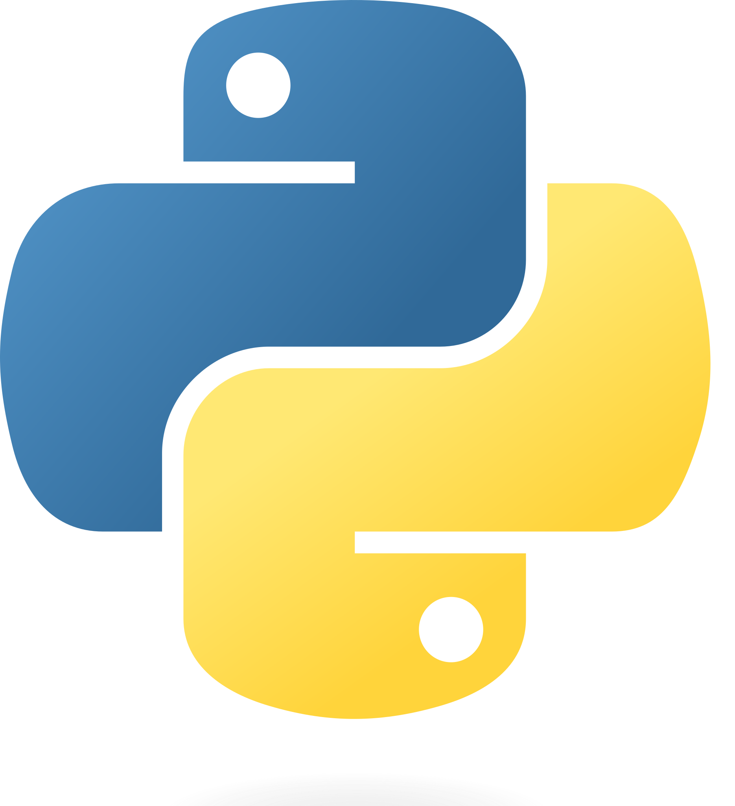

#  Introduction
***Python ek high-level programming language hai.***

1. Programming Kya Hai? (What is Programming?)
   > Programming ek process hai jisme hum computer ko "Instructions" dete hain taaki wo kisi khaas task (kaam) ko poora kar sake. Jis language mein ye instructions diye jate hain, use Programming Language kehte hain.
   
2. Python Ka Introduction
    >Python ek High-level, Interpreted, aur General-purpose programming language hai. Ise Guido van Rossum ne 1991 mein release kiya tha
    >* **High-level:** Iska matlab hai ki iska syntax (likhne ka tarika) kaafi had tak English jaisa hai, jo humans ke liye samajhna aasaan hai.
    >* **Interpreted:** Python ka code line-by-line execute hota hai, jo debugging (galtiyaan nikalne) ko asaan banata hai.

3. Python Kyun Seekhein? (Key Features)
    >Aap introduction mein Python ki ye khoobiyaan zaroor likhen:
    >* **Easy to Read:** Iska code chhota aur saaf hota hai (C++ ya Java ke muqable).
    >* **Huge Libraries:** Ismein har kaam ke liye pehle se bani banayi libraries mil jati hain (jaise Data Science ke liye Pandas, ya Game development ke liye Pygame).
    >* **Versatile:** Iska use Web Development, AI, Machine Learning, Automation, aur Data Analysis har jagah hota hai.

4. Ek Chhota Example
    >Programming ka matlab samjhane ke liye aap "Hello World" ka example de sakte hain:
    >>print("Hello, World!")
    >Sirf ek line mein Python apna kaam kar deta hai, jo ise beginners ke liye best banata hai.